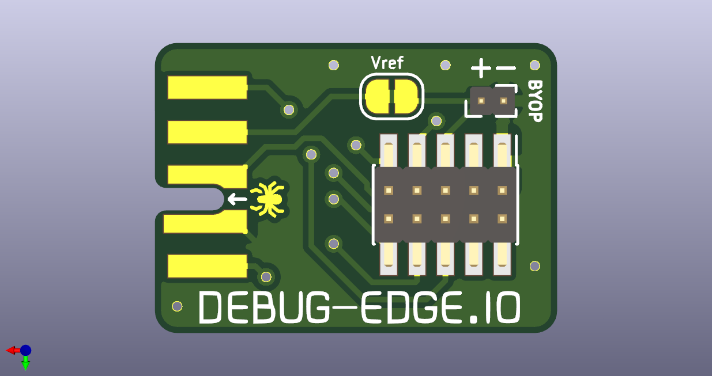

# Debug Edge
A small bridge board to link a programmer to a PCB, via a card edge connector.
See [debug-edge.io](https://debug-edge.io/) for more the full specification and rationale.

## Goals

A nice, easy to use debug/flash probe adapter that can quickly and easily connect to a board, staying put as you need it!

## Concept

Greg Davill [mentioned](https://twitter.com/GregDavill/status/1298419285086199808) coming across the AVX Open Ended Card Edge connector, and Scott Shawcroft [followed up](https://twitter.com/tannewt/status/1298422601811808256) that it'd be a good idea to explore a conversion from a typical 10-pin SWD/JTAG connector to the card edge format.
